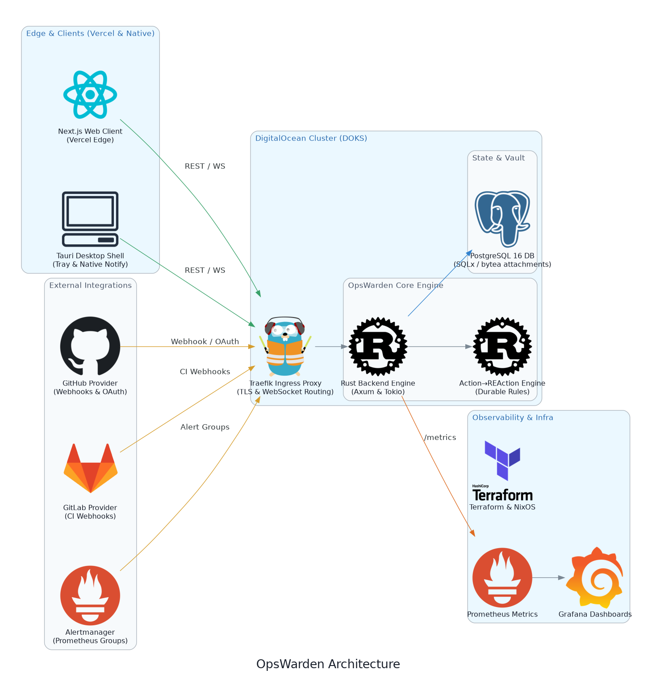

# OpsWarden

**OpsWarden** is a modern, ultra-performant monitoring and alerting platform for Cloud-Native infrastructures. Designed for demanding DevOps teams, it combines a blazing-fast Rust backend, a seamless Next.js web interface, and deep integration with the Kubernetes ecosystem to keep an absolute eye on your systems' health in real-time.

To use the web application:
- [Marketing Website](https://opswarden.dev/)
- [Web Application](https://app.opswarden.dev/en/login)

To download the desktop application, see the [latest releases](https://github.com/opswarden-git/opswarden/releases).

To browse the source code:
- [opswarden](https://github.com/opswarden-git/opswarden): Source code for the API (Rust), frontend (Next.js), and desktop client (Tauri).
- [opswarden-ops](https://github.com/opswarden-git/opswarden-ops): Infrastructure-as-Code (Terraform) and Kubernetes deployment manifests.
- [opswarden-website](https://github.com/opswarden-git/opswarden-website): The marketing website.

For contributors, you will be happy to explore the [Official Wiki](https://opswarden-git.github.io/opswarden/).

